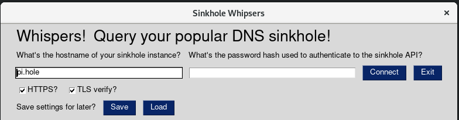
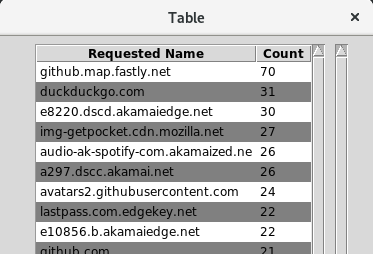
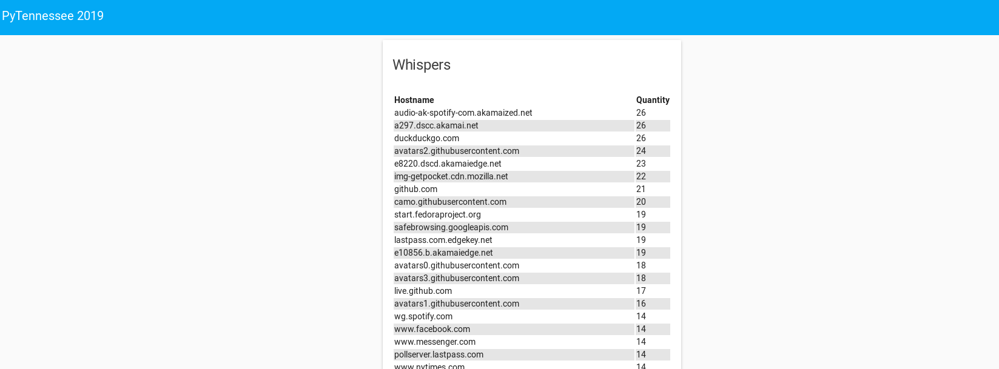

Hearing the whispers from your yappy [Pi-hole](https://pi-hole.net/)
=================

This was my [PyTennessee](https://www.pytennessee.org/) presentation in 2019, sharing the popular and extremely useful DNS sinkhole, [Pi-hole](https://pi-hole.net/).  The premise of this presentation was to show how home users and even enterprises can use some of the great work of the Python community to solve their problems with relative ease.  I used two approaches at showing me which sites are requested on my network and permitted by Pi-hole but very infrequently.  **The "right" approach is to probably support sorting the table in the Pi-hole dashboard and sorting in an ascending order.**  That said, it was a lot of fun playing with some of the new features in Python 3.7 and the PySimpleGUI project I learned about while listening to Michael Kennedy's podcast "Python Bytes".

Demo Credentials
----------

- Pihole: `pihole` is the password
- Home Assistant: `jeremy` is the password

PySimpleGUI approach
----------

PySimpleGUI was insanely easy to set up and use.  The only problem I had with this approach was just how ugly tkinter really is!  WxPython wasn't much better and the Qt support was shaky at the time I prepared for the presentation.

To try the PySimpleGUI app you can invoke it like this:

```python
$ pipenv run start
```






Home Assistant Display
-----



Awesome resources I used to build the card in the HA Lovelace UI:
    - [Flex Table Card](https://github.com/custom-cards/flex-table-card)
    - [Variable Component](https://github.com/rogro82/hass-variables)

I've arbitrarily defined a "whisper" to be any name requested of Pi-hole that was permitted but only encountered by Pi-hole less than 50 times.  This helps exclude the noise and show those domains that are still being called, just relatively infrequently compared to others.  These could be potentially blockable ad domains or indicate suspcious traffic from a compromised device.

For the demo, rather than build my own container for appdaemon I used the one referenced in their documentation.  Because it uses Python 3.6 and not Python 3.7 I copied the class in `whispers.connection` and refactored it to exclude `asyncio` and `@dataclass`.  I'm not saying it won't work with those things but I got it working without them.  Feel free to try and update the code if it's interesting.

The Docker Compose file provided in `compose/docker-compose.yaml` can be used to stand up the "stack", running the following containers:

```bash
# docker-compose up -d --build
```

- [Home Assistant](https://www.home-assistant.io/): Display our UI on a commonly used (and often running alongside Pi-hole) home automation platform

Motivation
--------

- [Python Bytes Podcast](https://pythonbytes.fm/) helped me learn about some of the projects I used in the demo

Thank you to the [Pi-hole](https://pi-hole.net/) developers and community and the [Home Assistant](https://www.home-assistant.io/) developers and community for making such awesome projects.  I use these at home and encourage you to support them too!
